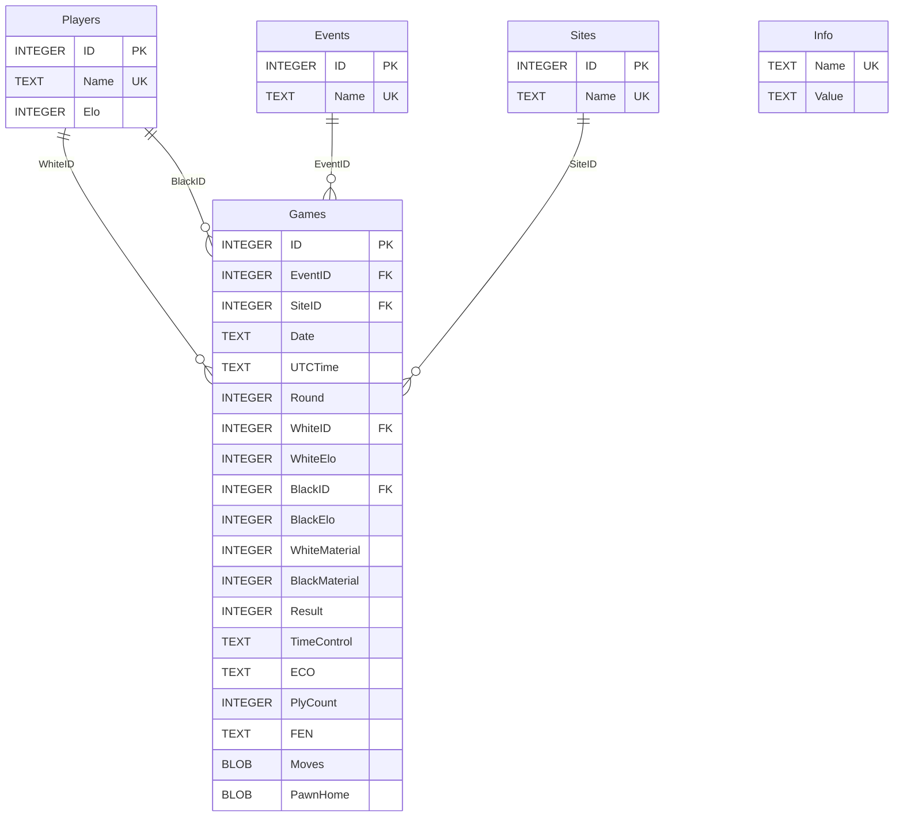

# Caissabase 2024 (`caissabase_2024.db3`) — Database Structure & Extraction Guide

## 1. Overview

| Property      | Value |
|---------------|-------|
| File          | `caissabase_2024.db3` (~1.3 GB) |
| Format        | **SQLite 3** (plain SQLite; `.db3` is just an extension) |
| Produced by   | [En Croissant](https://github.com/franciscoBSalgueiro/en-croissant) chess GUI, DB format version `1.0.0` |
| Games         | 5,404,926 |
| Players       | 321,095 |
| Events        | 50,638 |
| Sites         | 22,318 |
| Date range    | 1610 – 2024-04-22 (bulk is 1990s–2020s) |

You can open it with any SQLite tool (`sqlite3` CLI, DB Browser for SQLite, Python's built-in `sqlite3`).
Everything is standard relational data **except `Games.Moves`**. That column is a compact binary move
encoding that needs a chess move generator to decode (see [section 4](#4-the-moves-blob-encoding)).

---

## 2. Entity-relationship diagram



---

## 3. Tables

### 3.1 `Games` (5,404,926 rows)

```sql
CREATE TABLE Games (
    ID INTEGER PRIMARY KEY AUTOINCREMENT,
    EventID INTEGER,        -- FK -> Events.ID
    SiteID INTEGER,         -- FK -> Sites.ID
    Date TEXT,
    UTCTime TEXT,
    Round INTEGER,
    WhiteID INTEGER,        -- FK -> Players.ID
    WhiteElo INTEGER,
    BlackID INTEGER,        -- FK -> Players.ID
    BlackElo INTEGER,
    WhiteMaterial INTEGER,
    BlackMaterial INTEGER,
    Result INTEGER,
    TimeControl TEXT,
    ECO TEXT,
    PlyCount INTEGER,
    FEN TEXT,
    Moves BLOB,
    PawnHome BLOB,
    ...foreign keys...
);
```

| Column | Real content | Notes |
|---|---|---|
| `ID` | integer | Game ID, 1…5,404,935 (with a few gaps). |
| `EventID` | integer | → `Events.ID`. Always set (no `0`/Unknown in this DB). |
| `SiteID` | integer | → `Sites.ID`. Always set. |
| `Date` | text `YYYY.MM.DD` | PGN date format. Unknown parts are `??`, e.g. `1961.??.??`. Because the format is fixed, **string comparison sorts correctly**, e.g. `Date >= '2020.01.01'`. |
| `UTCTime` | always `NULL` | Unused in this DB. |
| `Round` | **mixed type** | Declared INTEGER, so SQLite coerced values: `"3"` → `3` (integer, 60%), `"3.2"` → `3.2` (REAL, 36%), `"?"`, `"-"`, `"?.5"` → text (4%). ⚠ Round `"1.10"` was stored as the REAL `1.1`, so trailing zeros are lost. |
| `WhiteElo` / `BlackElo` | integer or `NULL` | ~927k games have no Elo. 4.2M games have both. |
| `WhiteMaterial` / `BlackMaterial` | integer 0–39 | **Minimum** material each side had at any point in the game (P=1, N=B=3, R=5, Q=9). Used by En Croissant for endgame search. |
| `Result` | **text** | Declared INTEGER but stores the PGN string: `1-0` (2.15M), `0-1` (1.72M), `1/2-1/2` (1.53M), `*` (457). |
| `TimeControl` | always `NULL` | Unused. |
| `ECO` | text or `NULL` | 3 chars (`B20`) or 4 chars with a Scid-style sub-code (`A45w`, `D12m`). 87 games have none. |
| `PlyCount` | integer | Number of half-moves. Always equals the number of move bytes in `Moves`. 9,286 games have 0 moves. |
| `FEN` | text or `NULL` | Starting position for non-standard starts (88 games). `NULL` = normal initial position. |
| `Moves` | BLOB | Encoded mainline, **1 byte per ply**. See [section 4](#4-the-moves-blob-encoding). |
| `PawnHome` | integer (16-bit mask) | Pawns still on their home squares **at the end of the game**. Low byte: white pawns on rank 2 (bit0 = a2 … bit7 = h2). High byte: black pawns on rank 7 (bit8 = a7 … bit15 = h7). Used for fast position search. |

### 3.2 `Players` (321,095 rows)

```sql
CREATE TABLE Players (ID INTEGER PRIMARY KEY, Name TEXT UNIQUE, Elo INTEGER);
```

| Column | Notes |
|---|---|
| `ID` | Player ID. `0` = `"Unknown"`. |
| `Name` | Unique, usually `"Last, First"`. **The same person often has several entries**, e.g. `Carlsen, Magnus` (2,543 games) and `Carlsen, M` (3,263 games, mostly online blitz/bullet). Names are case-sensitive in `=` comparisons. |
| `Elo` | Always `NULL`. Ratings are only per game, in `Games.WhiteElo/BlackElo`. |

### 3.3 `Events` (50,638 rows) and `Sites` (22,318 rows)

```sql
CREATE TABLE Events (ID INTEGER PRIMARY KEY AUTOINCREMENT, Name TEXT UNIQUE);
CREATE TABLE Sites  (ID INTEGER PRIMARY KEY AUTOINCREMENT, Name TEXT UNIQUE);
```

These are lookup tables for the PGN `Event` and `Site` tags. ID `0` = `"Unknown"`.
Examples: `24th ch-EUR Indiv w 2024`, `Rhodes GRE`.

### 3.4 `Info` (7 rows)

Key/value metadata:

| Name | Value |
|---|---|
| Version | 1.0.0 |
| Title | Caissabase 2024 |
| Description | *(empty)* |
| GameCount | 5404935 |
| PlayerCount | 321095 |
| EventCount | 50638 |
| SiteCount | 22318 |

### 3.5 `sqlite_sequence`

This is SQLite's internal AUTOINCREMENT counter table. It isn't relevant for reading.

### 3.6 Indexes

| Index | Column | Use it for |
|---|---|---|
| `games_white_idx` | `Games.WhiteID` | games of a player as White |
| `games_black_idx` | `Games.BlackID` | games of a player as Black |
| `games_date_idx` | `Games.Date` | date ranges |
| `games_white_elo_idx` / `games_black_elo_idx` | Elo | rating filters |
| `games_result_idx` | `Result` | result filters |
| `games_plycount_idx` | `PlyCount` | game length filters |
| autoindex on `Players.Name`, `Events.Name`, `Sites.Name` | Name | exact name lookups |

Lookups by player are fast. Use `WhiteID = ? ` / `BlackID = ?` (or `IN (...)`), not a join on the name.
`LIKE '%foo%'` on `Players.Name` scans the table, but 321k rows still takes only ~0.1 s.

---

## 4. The `Moves` BLOB encoding

Each byte is the **index of the played move in the list of legal moves** of the current position.
The list is in the exact order produced by the Rust chess library
[shakmaty](https://github.com/niklasf/shakmaty) (`Chess::legal_moves()`), which En Croissant uses:

```rust
// en-croissant/src-tauri/src/db/encoding.rs
pub fn encode_move(m: &Move, chess: &Chess) -> Result<u8, Error> {
    let moves = chess.legal_moves();
    Ok(moves.iter().position(|x| x == m).unwrap() as u8)
}
```

So you can't decode a byte on its own. You have to replay the game from the start position (or from `FEN`)
and generate the legal moves at each step **in shakmaty's order**.

### 4.1 shakmaty legal-move order

Squares are numbered `a1=0, b1=1, … h1=7, a2=8, … h8=63`. "By square" means ascending in that numbering.

1. **En passant** captures (by from-square).
2. If the side to move is **not in check**:
   1. Pawn captures toward the a-file (by to-square: non-promotions first, then promotions in the order Q, R, B, N)
   2. Pawn captures toward the h-file (same ordering)
   3. Single pawn pushes (non-promotions by to-square, then promotions Q, R, B, N)
   4. Double pawn pushes (by to-square)
   5. Knight moves → 6. Bishop → 7. Rook → 8. Queen (each: by from-square, then to-square)
   9. King moves (by to-square)
   10. Castling king-side, then queen-side
3. If **in check**: king moves come first (by to-square), then the non-king moves 2.1–2.8 that block the check or capture the checker.
4. Illegal moves (pinned pieces, etc.) are removed. The relative order is preserved.

`caissabase.py` reproduces this as a sort key over python-chess's legal moves (`legal_moves_ordered()`).

### 4.2 Worked example (game ID 1, ECO A45w)

`Moves` = `0b 12 17 0d 16 0b …` (39 bytes, `PlyCount` = 39)

| Byte | Index | Legal moves in shakmaty order | Move |
|---|---|---|---|
| `0x0b` | 11 | `0:a3 1:b3 … 7:h3 8:a4 9:b4 10:c4 11:d4 12:e4 … 16:Na3 17:Nc3 18:Nf3 19:Nh3` | **1. d4** |
| `0x12` | 18 | `0:a6 … 15:h5 16:Na6 17:Nc6 18:Nf6 19:Nh6` | **1… Nf6** |
| `0x17` | 23 | `0:a3 … 15:Nd2 16:Na3 … 20:Bd2 21:Be3 22:Bf4 23:Bg5 24:Bh6 25:Qd2 26:Qd3 27:Kd2` | **2. Bg5** |
| `0x0d` | 13 | `0:a6 … 12:h5 13:Ne4 14:Ng4 15:Nd5 16:Nh5 17:Ng8 18:Na6 19:Nc6 20:Rg8` | **2… Ne4** |

### 4.3 Marker bytes (newer En Croissant versions only)

Newer En Croissant versions can also store annotations in the blob using bytes ≥ 252:
`255` = variation start, `254` = variation end, `253` = comment, `252` = NAG.
The comment and NAG markers are followed by a u16 little-endian length and a UTF-8 payload.
**Caissabase 2024 has none of these.** Every byte is a move index (max seen: 74), so the export has no comments or variations.
`caissabase.mainline_bytes()` skips the markers anyway, so the decoder still works on newer databases.

### 4.4 Verification

The decoder was checked against the columns that En Croissant derives from the final position.
27,111 games were tested (every 200th game plus all 88 FEN games):

- `PawnHome` recomputed from the decoded final position: **100% match**
- `WhiteMaterial` / `BlackMaterial` (minimum material along the game): **100% match**
- All 2,543 exported Carlsen games re-parse with python-chess with no errors.

Only 3 games ended in checkmate with the opposite result recorded, e.g. game 5,296,000 ends `12… Qxh2#` with `1-0` recorded.
These are errors in the source data, not decoding errors.

---

## 5. Data-extraction examples

### 5.1 Setup

```bash
source venv/bin/activate
pip install -r requirements.txt     # python-chess
```

### 5.2 Command-line export (`export_pgn.py`)

```bash
# 1. find how the player is spelled (SQL LIKE pattern, % = wildcard)
python export_pgn.py --search "Carlsen%"
#   2876    3263 games  Carlsen, M
#  73583    2543 games  Carlsen, Magnus
#  ...

# 2. export by exact name
python export_pgn.py "Carlsen, Magnus" -o carlsen.pgn

# 3. several spellings of the same player (--name/--id are repeatable, --ids takes a list)
python export_pgn.py --ids 73583,2876 -o carlsen_all.pgn
python export_pgn.py --name "Carlsen, Magnus" --name "Carlsen, M" -o carlsen_all.pgn

# 4. ...and union them into one identity: every "Carlsen, M" in the White/Black
#    headers is rewritten to the first given name, "Carlsen, Magnus"
python export_pgn.py --name "Carlsen, Magnus" --name "Carlsen, M" --merge -o carlsen_all.pgn

# 5. same, but with a canonical name of your choice
python export_pgn.py --name "Carlsen, M" --id 73583 --merge-as "Magnus Carlsen" -o carlsen_all.pgn

# filters: color and date range
python export_pgn.py --ids 73583,2876 --color white --from 2020.01.01 -o carlsen_white.pgn
python export_pgn.py "Kasparov, Garry" --from 1985.01.01 --to 1990.12.31 -o kasparov_85_90.pgn

# game length in full moves: 20+ moves, at most 25 moves, or a range
python export_pgn.py "Carlsen, Magnus" --min-moves 20 -o carlsen_20plus.pgn
python export_pgn.py "Carlsen, Magnus" --max-moves 25 -o carlsen_miniatures.pgn
python export_pgn.py "Carlsen, Magnus" --min-moves 20 --max-moves 40 -o carlsen_20_40.pgn

# search counts honour the filters
python export_pgn.py --search "Carlsen%" --min-moves 20
```

| Option | Meaning |
|---|---|
| `NAME` (positional) / `--name NAME` | exact player name; both may be repeated and combined |
| `--id ID` | player ID (repeatable), as printed by `--search` |
| `--ids ID,ID,...` | comma-separated player IDs (repeatable). Mixes with `--id`/`--name`; command-line order is kept and duplicates are dropped. The first player names a `--merge` |
| `--merge` | report all selected identities under the first given name/ID |
| `--merge-as NAME` | report all selected identities under `NAME` (implies `--merge`) |
| `--color white\|black` | only games with that color (for any of the selected identities) |
| `--from` / `--to` | inclusive date bounds, `YYYY.MM.DD` |
| `--min-moves N` | skip games shorter than N full moves; filtered in SQL as `PlyCount >= 2*N - 1` |
| `--max-moves N` | skip games longer than N full moves; filtered in SQL as `PlyCount <= 2*N` (see [5.6](#56-filtering-by-game-length)) |
| `--search PATTERN` | list matching players with game counts, then exit. Counts honour `--color`, `--from`, `--to` and the move filters |
| `-o FILE` | output file (default: stdout) |

An unknown name or ID stops the export with exit code 1, so a typo can't silently drop games.
Merging only changes the PGN headers; the database is never modified.

Before merging, check that a short spelling really is the same person: `Carlsen, E` is not Magnus.
Also, the same game is sometimes stored under two spellings. `Carlsen, Magnus` + `Carlsen, M` contain
6 such duplicate pairs (same date and moves) among 5,806 games.

Speed is about 150 games/s: 2,543 games take ~17 s. Nearly all of that time is move decoding.

### 5.3 Python API (`caissabase.py`)

```python
import caissabase as cb

con = cb.connect("caissabase_2024.db3")            # read-only connection

# find players
for p in cb.find_players(con, "Carlsen, M%"):
    print(p.id, p.name, p.games)

# stream games → PGN file
with open("carlsen.pgn", "w") as f:
    for row in cb.iter_player_games(con, [73583, 2876], color=None, date_from="2019.01.01"):
        f.write(cb.row_to_pgn(row) + "\n\n")

# union several identities under one name
players, missing = cb.resolve_players(con, ["Carlsen, Magnus", "Carlsen, M"])
ids = [p.id for p in players]
rename = cb.merge_identities(ids, "Carlsen, Magnus")     # {73583: ..., 2876: ...}
with open("carlsen_all.pgn", "w") as f:
    for row in cb.iter_player_games(con, ids):
        f.write(cb.row_to_pgn(row, rename) + "\n\n")

# work with python-chess objects instead of text
row = next(cb.iter_player_games(con, [73583]))
game = cb.row_to_game(row)                          # chess.pgn.Game
board = game.end().board()                          # final position
print(game.headers["White"], game.headers["Black"], board.fen())

# decode a raw blob yourself
moves = cb.decode_moves(row["Moves"], row["FEN"])   # list[chess.Move]
```

### 5.4 Raw SQL recipes

Run these with `sqlite3 caissabase_2024.db3` or Python's `sqlite3`.

**Player lookup**
```sql
SELECT ID, Name FROM Players WHERE Name LIKE 'Carlsen%';
SELECT ID FROM Players WHERE Name = 'Carlsen, Magnus';     -- uses the unique index
```

**All games of a player with readable headers** (moves are still binary)
```sql
SELECT g.ID, g.Date, e.Name AS Event, s.Name AS Site, g.Round,
       w.Name AS White, g.WhiteElo, b.Name AS Black, g.BlackElo,
       g.Result, g.ECO, g.PlyCount
FROM Games g
JOIN Players w ON w.ID = g.WhiteID
JOIN Players b ON b.ID = g.BlackID
JOIN Events  e ON e.ID = g.EventID
JOIN Sites   s ON s.ID = g.SiteID
WHERE g.WhiteID = 73583 OR g.BlackID = 73583
ORDER BY g.Date;
```

**Player score summary**
```sql
SELECT
  SUM((WhiteID = :id AND Result = '1-0') OR (BlackID = :id AND Result = '0-1')) AS wins,
  SUM(Result = '1/2-1/2')                                                        AS draws,
  SUM((WhiteID = :id AND Result = '0-1') OR (BlackID = :id AND Result = '1-0')) AS losses
FROM Games WHERE WhiteID = :id OR BlackID = :id;
```

**Head-to-head**
```sql
SELECT ID, Date, Result FROM Games
WHERE (WhiteID = :a AND BlackID = :b) OR (WhiteID = :b AND BlackID = :a);
```

**Opening repertoire of a player as White**
```sql
SELECT substr(ECO, 1, 3) AS eco, COUNT(*) AS n
FROM Games WHERE WhiteID = :id GROUP BY eco ORDER BY n DESC LIMIT 10;
```

**Top-level games in a period**
```sql
SELECT ID FROM Games
WHERE Date BETWEEN '2023.01.01' AND '2023.12.31~'
  AND WhiteElo >= 2700 AND BlackElo >= 2700;
```

**Endgame search via material** (games where both sides dropped to ≤ 10 points of material at some point)
```sql
SELECT ID FROM Games WHERE WhiteMaterial <= 10 AND BlackMaterial <= 10 LIMIT 100;
```

**Players with the most games**
```sql
SELECT p.Name, COUNT(*) AS n
FROM (SELECT WhiteID AS pid FROM Games UNION ALL SELECT BlackID FROM Games) t
JOIN Players p ON p.ID = t.pid
GROUP BY t.pid ORDER BY n DESC LIMIT 20;
```

### 5.5 Minimal self-contained decoder

This is the core of the decoder, if you want to port it (e.g. to TypeScript with chess.js):

```python
import chess

PROMO = {chess.QUEEN: 0, chess.ROOK: 1, chess.BISHOP: 2, chess.KNIGHT: 3}
GROUP = {chess.KNIGHT: 6, chess.BISHOP: 7, chess.ROOK: 8, chess.QUEEN: 9}

def key(board, m, in_check):
    f, t = m.from_square, m.to_square
    if board.is_en_passant(m):
        return (0, f)
    piece = board.piece_type_at(f)
    if piece == chess.KING:
        if board.is_castling(m):
            return (20 if board.is_kingside_castling(m) else 21,)
        return (1 if in_check else 19, t)
    if piece == chess.PAWN:
        promo, pr = m.promotion is not None, PROMO.get(m.promotion, 0)
        if chess.square_file(f) != chess.square_file(t):          # capture
            return (2 if chess.square_file(t) < chess.square_file(f) else 3, promo, t, pr)
        if abs(t - f) == 16:
            return (5, t)                                         # double push
        return (4, promo, t, pr)                                  # single push
    return (GROUP[piece], f, t)

def decode(blob, fen=None):
    board = chess.Board(fen) if fen else chess.Board()
    for idx in blob:
        legal = sorted(board.legal_moves, key=lambda m: key(board, m, board.is_check()))
        board.push(legal[idx])
    return board.move_stack
```

### 5.6 Filtering by game length

Game length is measured in **full moves**, matching PGN move numbers (`1. e4 e5` = 1 move). A game has N moves
once White has played move N. The database stores half-moves (`PlyCount`), and the filters convert as follows:

| Filter | SQL condition | Example |
|---|---|---|
| `--min-moves N` / `min_moves=N` | `PlyCount >= 2*N - 1` | `--min-moves 20` keeps games whose last move is `20. …` or later |
| `--max-moves N` / `max_moves=N` | `PlyCount <= 2*N` | `--max-moves 25` keeps games ending at `25. …` or `25… …` at the latest |

| `PlyCount` | Last move | Full moves |
|---|---|---|
| 38 | `19… Nf6` | 19 |
| 39 | `20. d5` | 20 |
| 40 | `20… Kh8` | 20 |
| 41 | `21. Qh5` | 21 |

Both bounds are inclusive and can be combined with each other and with `--color`, `--from`/`--to` and `--merge`.
`PlyCount` is indexed (`games_plycount_idx`), and the filter runs in SQL, so skipped games are never decoded.

**CLI recipes**

All examples merge both Carlsen identities ("Carlsen, Magnus" + "Carlsen, M", 5806 games without filters):

```bash
# drop the empty (0-move) games ("Carlsen, M" has 8)                          -> 5798 games
python export_pgn.py --name "Carlsen, Magnus" --name "Carlsen, M" --merge --min-moves 1 -o carlsen.pgn

# only games of 40+ moves                                                     -> 3563 games
python export_pgn.py --name "Carlsen, Magnus" --name "Carlsen, M" --merge --min-moves 40 -o carlsen_40plus.pgn

# miniatures: at most 20 moves                                                -> 196 games
python export_pgn.py --name "Carlsen, Magnus" --name "Carlsen, M" --merge --max-moves 20 -o carlsen_miniatures.pgn

# a length range                                                              -> 3933 games
python export_pgn.py --name "Carlsen, Magnus" --name "Carlsen, M" --merge --min-moves 30 --max-moves 60 -o carlsen_30_60.pgn

# a length range combined with color and date
python export_pgn.py --name "Carlsen, Magnus" --name "Carlsen, M" --merge \
    --color white --from 2015.01.01 --min-moves 30 --max-moves 60 -o carlsen_white_30_60.pgn

# preview the counts per identity before exporting (search honours the filters)
python export_pgn.py --search "Carlsen, M%" --min-moves 40
#     2876    2077 games  Carlsen, M
#    73583    1486 games  Carlsen, Magnus
```

How the filters change the merged Carlsen export:

| Filter | Carlsen, Magnus | Carlsen, M | Merged export |
|---|---|---|---|
| none | 2543 | 3263 | 5806 |
| `--min-moves 1` | 2543 | 3255 | 5798 |
| `--min-moves 20` | 2482 | 3164 | 5646 |
| `--min-moves 40` | 1486 | 2077 | 3563 |
| `--min-moves 60` | 459 | 670 | 1129 |
| `--max-moves 20` | 78 | 118 | 196 |
| `--max-moves 25` | 205 | 251 | 456 |
| `--min-moves 30 --max-moves 60` | 1731 | 2202 | 3933 |

**Python**

```python
import caissabase as cb

con = cb.connect()
players, _ = cb.resolve_players(con, ["Carlsen, Magnus", "Carlsen, M"])
CARLSEN = {p.id for p in players}                    # {73583, 2876}
rename = cb.merge_identities(CARLSEN, "Carlsen, Magnus")

# all games between 30 and 60 moves (3933 games)
rows = cb.iter_player_games(con, CARLSEN, min_moves=30, max_moves=60)

# decisive miniatures won by the player (combine the SQL filter with a Python check)
wins = [
    r for r in cb.iter_player_games(con, CARLSEN, max_moves=25)
    if (r["WhiteID"] in CARLSEN and r["Result"] == "1-0")
    or (r["BlackID"] in CARLSEN and r["Result"] == "0-1")
]
with open("carlsen_won_miniatures.pgn", "w") as f:
    for r in wins:
        f.write(cb.row_to_pgn(r, rename) + "\n\n")

# filtered game counts per identity
for p in cb.find_players(con, "Carlsen, Ma%", min_moves=20):
    print(p.id, p.name, p.games)
```

**Raw SQL**

```sql
-- games of both Carlsen identities with 30–60 full moves (3933 rows)
SELECT ID, Date, Result, (PlyCount + 1) / 2 AS moves
FROM Games
WHERE (WhiteID IN (73583, 2876) OR BlackID IN (73583, 2876))
  AND PlyCount BETWEEN 2*30 - 1 AND 2*60;

-- game-length distribution, in 10-move buckets
SELECT (PlyCount + 1) / 2 / 10 * 10 AS moves_from, COUNT(*) AS games
FROM Games
WHERE WhiteID IN (73583, 2876) OR BlackID IN (73583, 2876)
GROUP BY moves_from ORDER BY moves_from;
--  0|44   10|116   20|672   30|1411   40|1447   50|987   60|613   70|266   80|137   90|59 ...

-- the longest games in the whole database
SELECT ID, Date, (PlyCount + 1) / 2 AS moves FROM Games ORDER BY PlyCount DESC LIMIT 10;
```

### 5.7 Checking and deduplicating a PGN (`pgndoctor.py`)

`pgndoctor.py` works on any `.pgn` (or a `.zip` of PGNs), not only on exports from this database.
It's most useful after a `--merge` export, where one game is often stored under several spellings.

```bash
python pgndoctor.py -f lasker.pgn                        # summary (same as --info)
python pgndoctor.py -f lasker.pgn --info --json          # summary as JSON
python pgndoctor.py -f lasker.pgn --dedup                # -> lasker.dedup.pgn
python pgndoctor.py -f lasker.pgn --dedup --dedup-probable -o lasker_clean.pgn
```

It detects two kinds of duplicate:

- **Exact duplicates** have the same start position and mainline moves, whatever their headers say.
- **Probable duplicates** have different move data but the same players, year and result, and a position-set
  similarity of at least 0.5.

The merged Lasker export (`--ids 316247,297878 --merge --min-moves 15`, 1187 games) contains 30 exact and
33 probable duplicates. `--dedup` leaves 1157 games, and adding `--dedup-probable` leaves 1124. For the options,
the detection rules and their calibration, and the architecture, see **[PGNDOCTOR.md](PGNDOCTOR.md)**.

The summary also shows data-quality problems. In the Lasker export, the top player's years are `1889-1976`,
although Emanuel Lasker died in 1941: `Lasker, E.` also contains Edward Lasker's games (see section 6).

---

## 6. Gotchas / data quality

- **Duplicate player identities.** One person may appear under several spellings (`Carlsen, Magnus` / `Carlsen, M`).
  Search with `LIKE` first, then pass all relevant names/IDs and optionally `--merge` them (see 5.2).
  The reverse happens too: a short spelling can mix several people. `Lasker, E.` holds Emanuel Lasker's games
  up to 1936 plus about 46 games from 1946–1976, which are Edward Lasker's. Merged exports also contain the same
  game under several spellings. Check them with `pgndoctor.py` (see 5.7).
- **`Result` and `Round` ignore their declared INTEGER type.** Compare `Result` with strings (`'1-0'`),
  and expect `Round` to be int, float or text.
- **No annotations.** The PGNs contain only the mainline: no comments, clock times or variations.
- **Games with 0 plies** (9,286) produce PGNs with just the result. Drop them with `--min-moves 1`.
- **`UTCTime`, `TimeControl`, `Players.Elo` are always NULL.**
- **Extended ECO** codes (`A45w`) aren't strictly PGN-standard. Use `substr(ECO,1,3)` if you need plain ECO.
- **FEN games** (88) get `[SetUp "1"]` and `[FEN "..."]` headers. Some store the standard start position with
  no castling rights (`... w - - 0 1`).
- A few results contradict the final position (see 4.4). The source data wasn't cleaned.
- Open the file **read-only** (`file:...?mode=ro`, as `cb.connect()` does) so you don't accidentally modify the 1.3 GB file.

## 7. Files in this repo

| File | Purpose |
|---|---|
| `caissabase.py` | Library: connection, player search, game query, move decoder, PGN conversion |
| `export_pgn.py` | CLI to export a player's games to PGN |
| `pgndoctor.py` | CLI to summarize any PGN file and remove duplicate games |
| `requirements.txt` | `chess` (python-chess) |
| `docs/CAISSABASE_DB.md` | This document |
| `docs/PGNDOCTOR.md` | `pgndoctor.py` reference and architecture |
