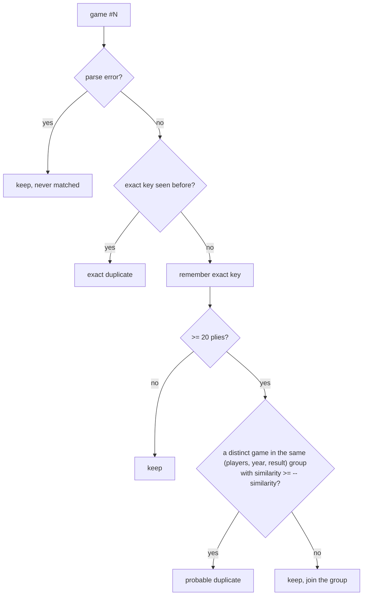

# `pgndoctor.py` — PGN inspection and duplicate removal

## 1. Overview

`pgndoctor.py` reads a PGN file (or a `.zip` of PGN files), prints a summary of what is in it, and can write a copy
without duplicate games. It is standalone: it reads any PGN, doesn't touch the Caissabase database and doesn't import
`caissabase.py`. The only dependency is python-chess.

The tool exists because of what `export_pgn.py --merge` produces. When one player is stored under several spellings,
the same game is often stored once per spelling, and the copies rarely match exactly:

| | Copy 1 (`Lasker, Emanuel`) | Copy 2 (`Lasker, E.`) |
|---|---|---|
| Date | `1925.??.??` | `1925.11.25` |
| Event | `Zuerich` | `Zurich` |
| Round | `?` | `1` |
| Opponent | `Mueller, Hans` | `Muller, H.` |
| Moves | identical, or with two moves swapped by a transcription error | |

Comparing headers doesn't find these copies, and neither does comparing whole PGN texts. `pgndoctor.py` compares the
**games themselves** instead.

---

## 2. Quick start

```bash
# 1. export a merged player (two spellings of Emanuel Lasker)
python export_pgn.py --ids 316247,297878 --merge --min-moves 15 -o lasker.pgn

# 2. look at the file: summary plus a list of every duplicate
python pgndoctor.py -f lasker.pgn --list 0

# 3. remove exact duplicates                       -> lasker.dedup.pgn (1157 of 1187 games)
python pgndoctor.py -f lasker.pgn --dedup

# 4. after reviewing the probable duplicates in step 2, remove them too    -> 1124 games
python pgndoctor.py -f lasker.pgn --dedup --dedup-probable -o lasker_clean.pgn

# 5. check the result: 0 exact, 0 probable
python pgndoctor.py -f lasker_clean.pgn
```

More examples:

```bash
python pgndoctor.py -f games.zip                          # every .pgn inside the zip, numbered as one sequence
python pgndoctor.py -f games.pgn --json > games.json      # machine-readable summary
python pgndoctor.py -f games.pgn --info --dedup           # summary and cleaned file in one pass
python pgndoctor.py -f games.pgn --similarity 0.7         # stricter probable-duplicate matching
python pgndoctor.py -f games.pgn --min-plies 0            # short games match on moves alone
python pgndoctor.py -f games.pgn --top 25 --list 0        # longer top lists, list every duplicate
```

---

## 3. Options

```
usage: pgndoctor.py [-h] -f PGNFILE [--info] [--json] [--dedup]
                    [--dedup-probable] [-o OUTPUT] [--similarity X]
                    [--min-plies N] [--list N] [--top N]
```

| Option | Default | Meaning |
|---|---|---|
| `-f, --pgnfile FILE` | *required* | Input `.pgn`, or `.zip` (every `.pgn` inside is read, in archive order) |
| `--info` | on if `--dedup` isn't given | Print the text summary (section 4.1) |
| `--json` | off | Print the summary as JSON instead (section 4.2). Implies `--info` |
| `--dedup` | off | Write the file without exact duplicates to `-o` |
| `--dedup-probable` | off | With `--dedup`, also remove probable duplicates. Requires `--dedup` |
| `-o, --output FILE` | `<input>.dedup.pgn` next to the input | Output of `--dedup`. Must not be the input file |
| `--similarity X` | `0.5` | Minimum position-set similarity (0 < X ≤ 1) for probable duplicates (section 5.2) |
| `--min-plies N` | `6` | Games shorter than N plies are only exact duplicates if players and date also match. `0` compares moves only (section 5.3) |
| `--list N` | `20` | Entries per listing (parse errors, self-play, duplicates) in the text summary. `0` = all |
| `--top N` | `10` | Entries in the top players/events/sites/ECO lists |

Exit codes: `0` on success, `1` if the input file doesn't exist or a zip holds no `.pgn`, `2` on invalid options.

The input file is never modified. With `--json`, stdout carries only the JSON document, and the `--dedup` summary goes
to stderr.

---

## 4. Output

### 4.1 Text summary (`--info`)

Output of `python pgndoctor.py -f lasker.pgn --top 3 --list 2`:

```
File:                   lasker.pgn
Games:                  1187
  with parse errors:    0 (moves counted up to the error)
  without moves:        0
  custom start (FEN):   0
  self-play:            2 (White = Black)
Dates:                  1889.??.?? .. 1976.??.??
  precision:            2 complete, 1185 partial (e.g. 1925.??.??), 0 missing
  per decade:           1880s: 23, 1890s: 369, 1900s: 332, 1910s: 146, 1920s: 184, 1930s: 86, 1940s: 21, 1950s: 24, 1960s: 1, 1970s: 1
Results:                1-0: 464, 0-1: 423, 1/2-1/2: 297, *: 3
Length (plies):         min 29, median 75, mean 79.4, max 238
Players:                544 distinct
Events:                 151 distinct
Sites:                  121 distinct
ECO codes:              557 distinct
Duplicates:             30 exact, 33 probable (similarity >= 0.5)
  --dedup keeps:        1157 games (1124 with --dedup-probable)

Top players:
   games  years      name
    1189  1889-1976  Lasker, Emanuel
      50  1894-1899  Steinitz, Wilhelm
      49  1900-1931  Marshall, Frank

Top events:
     100  New York
     ...

Self-play games:
  #943: 1924.??.?? | New York | rd 1 | Lasker, Emanuel - Lasker, Emanuel | 1/2-1/2 | 206 plies
  #971: 1924.??.?? | New York | rd 1 | Lasker, Emanuel - Lasker, Emanuel | 0-1 | 102 plies

Exact duplicates (removed by --dedup):
  #25: 1890.??.?? | Berlin m 8990 | rd 2 | Von Bardeleben, Curt - Lasker, Emanuel | 1-0 | 99 plies
    = #21: 1889.??.?? | Berlin | rd 1 | Von Bardeleben, Curt - Lasker, Emanuel | 1-0 | 99 plies
  #28: 1890.??.?? | Berlin m 8990 | rd 1 | Lasker, Emanuel - Von Bardeleben, Curt | 1-0 | 93 plies
    = #22: 1889.??.?? | Berlin | rd 1 | Lasker, Emanuel - Von Bardeleben, Curt | 1-0 | 93 plies
  ... and 28 more (--list 0 shows all)

Probable duplicates (removed only with --dedup-probable; review first):
  #124: 1892.??.?? | Londen m | rd 1 | Blackburne, Joseph - Lasker, Emanuel | 0-1 | 98 plies
    ~ #98: 1892.??.?? | London | rd 1 | Blackburne, Joseph - Lasker, Emanuel | 0-1 | 100 plies  (similarity 0.72)
  #172: 1893.??.?? | New York | rd 10 | Lasker, Emanuel - Pollock, William | 1-0 | 97 plies
    ~ #166: 1893.??.?? | New York | rd 1 | Lasker, Emanuel - Pollock, William | 1-0 | 97 plies  (similarity 0.96)
  ... and 31 more (--list 0 shows all)
```

How to read it:

- **`#N`** is the game's 1-based position in the input. PGN games have no IDs, so this position is how a game is
  identified. For a zip, numbering continues across the member files.
- **Duplicate listings** show the removed copy first, then the kept game it duplicates: `=` for exact, `~` for
  probable, with the similarity.
- **Dates** compare as strings, which is correct for the PGN format `YYYY.MM.DD`. A date counts as *partial* if it
  contains `?` and as *missing* if it has no year (`????.??.??` or no `Date` tag). Per-decade counts and player year
  spans only use dated games.
- **Player game counts** add up White and Black appearances. A self-play game counts twice for its player, which is
  why `Lasker, Emanuel` shows 1189 games in a 1187-game file.
- **Player years** (first-last) are a quick contamination check. Emanuel Lasker died in 1941, so `1889-1976` shows
  that games of another player (Edward Lasker, via the `Lasker, E.` spelling) were merged in.
- **Lengths** are in plies (half-moves) of the mainline. For a game with a parse error, the plies are counted up to
  the error.
- **Missing headers** are shown as `?`. A missing `Result` is shown as `*`.

### 4.2 JSON summary (`--json`)

The same data as the text summary, with the complete duplicate list (not limited by `--list`). Shortened example:

```json
{
  "file": "lasker.pgn",
  "games": 1187,
  "parse_errors": [],
  "games_without_moves": 0,
  "games_with_custom_start": 0,
  "self_play": ["#943: 1924.??.?? | New York | rd 1 | Lasker, Emanuel - Lasker, Emanuel | 1/2-1/2 | 206 plies"],
  "players": {
    "distinct": 544,
    "top": [{"name": "Lasker, Emanuel", "games": 1189, "years": ["1889", "1976"]}]
  },
  "dates": {
    "min": "1889.??.??", "max": "1976.??.??",
    "complete": 2, "partial": 1185, "missing": 0,
    "decades": {"1880s": 23, "1890s": 369, "...": 0}
  },
  "results": {"1-0": 464, "0-1": 423, "1/2-1/2": 297, "*": 3},
  "plies": {"min": 29, "median": 75, "mean": 79.4, "max": 238},
  "events": {"distinct": 151, "top": [["New York", 100]]},
  "sites": {"distinct": 121, "top": [["New York, NY USA", 140]]},
  "eco": {"distinct": 557, "top": [["C66", 35]]},
  "duplicates": {
    "exact": 30,
    "probable": 33,
    "list": [
      {"kind": "exact",
       "game": "#25: 1890.??.?? | Berlin m 8990 | rd 2 | Von Bardeleben, Curt - Lasker, Emanuel | 1-0 | 99 plies",
       "kept": "#21: 1889.??.?? | Berlin | rd 1 | Von Bardeleben, Curt - Lasker, Emanuel | 1-0 | 99 plies",
       "similarity": 1.0},
      {"kind": "probable",
       "game": "#1137: 1936.??.?? | Nottingham | rd ? | Tartakower, Savielly - Lasker, Emanuel | 1/2-1/2 | 44 plies",
       "kept": "#1127: 1936.??.?? | Nottingham | rd 1 | Tartakower, Savielly - Lasker, Emanuel | 1/2-1/2 | 44 plies",
       "similarity": 0.76}
    ]
  }
}
```

Notes on the fields:

- `parse_errors` and `self_play` are lists of game descriptions. A `parse_errors` entry also ends with the error
  message.
- `plies` is `null` for a file with no games.
- `years` is `null` for a player with only undated games.
- `similarity` is `1.0` for exact duplicates.
- The `top` lists hold `[name, count]` pairs. Player entries are objects instead, because they also carry `years`.
- Undecodable bytes in header values appear as U+FFFD (`�`).

### 4.3 Cleaned file (`--dedup`)

```
$ python pgndoctor.py -f lasker.pgn --dedup
Removed 30 duplicates (30 exact); kept 33 probable duplicates
Wrote 1157 of 1187 games: lasker.dedup.pgn

$ python pgndoctor.py -f lasker.pgn --dedup --dedup-probable -o lasker_clean.pgn
Removed 63 duplicates (30 exact, 33 probable)
Wrote 1124 of 1187 games: lasker_clean.pgn
```

- **Game order is kept.** From each group of duplicates, the **first** copy in the file is kept.
- **Kept games are copied byte for byte.** Headers, comments, variations, NAGs, line wrapping and bytes that aren't
  valid UTF-8 are all preserved. The only change is that each game's surrounding whitespace is trimmed, and games are
  separated by one blank line.
- **Games with parse errors are kept whole**, including the moves after the error.
- **`--info --dedup` combined** prints the summary of the *input* first, then the dedup result.

---

## 5. Duplicate detection

Every game goes through these checks in order, and the first match decides:



### 5.1 Exact duplicates

Two games are exact duplicates when they have the **same start position** (FEN) **and the same mainline moves**.
Headers are ignored, as are comments and side variations.

The key is a 16-byte BLAKE2b digest of `start FEN + moves as UCI`, so memory use doesn't grow with game length.
Two special cases change what goes into the key:

| Game | What goes into the key |
|---|---|
| no moves (header-only stub) | `Event`, `Site`, `Date`, `Round`, `White`, `Black`, `Result`. Stubs are duplicates only if all 7 headers match |
| fewer than `--min-plies` plies (default 6) | start FEN + moves + `White`, `Black`, `Date` (section 5.3) |
| otherwise | start FEN + moves |

### 5.2 Probable duplicates

These are copies whose **move data differs** because of a transcription error, a truncated or longer game score, or
a move-order swap. Two games are probable duplicates when all of these hold:

1. They share a **group key**: the players in either color order, the **year** (`Date[:4]`), and the result.
   The year is used instead of the full date because copies often differ in date precision (`1925.??.??` vs.
   `1925.11.25`).
2. Both have **at least 20 plies**. Short games share too few positions to compare reliably.
3. Their **similarity** is at least `--similarity` (default 0.5).

Similarity is the **Jaccard index of the two games' position sets**:

```
similarity = |P(a) ∩ P(b)| / |P(a) ∪ P(b)|
```

`P(game)` is the set of positions before each mainline move, keyed by piece placement and side to move.
Move counters, castling rights and the en-passant square are ignored.

Positions are compared instead of move sequences because typical transcription errors are **move-order swaps**:
`12. Re1 h6 13. Bf4` in one copy and `12. Bf4 h6 13. Re1` in the other. The move lists differ from move 12 onward,
but the games pass through the same positions again, so the Jaccard index stays high. A longest-common-prefix
measure would score such pairs near 0. In the calibration data, some true copies had a common prefix of only 4–9%
of the game but a Jaccard index of 0.90–0.92.

**Calibration.** The threshold was chosen on labelled pairs from the Caissabase database: all games of
`Lasker, Emanuel` (ID 316247) and `Lasker, E.` (ID 297878) with ≥ 29 plies. Candidates were pairs with the same
opponent, year and result but different moves. A pair across the two IDs is either a copy of one game or two
different games. A pair within one ID is almost always two different games, typically from the same match.

| Similarity | Pairs found |
|---|---|
| 0.72 – 0.98 | copies across the two IDs, mostly with *equal* ply counts; also 3 pairs within one ID (duplicates the database stores under one spelling) |
| 0.52 – 0.57 | copies across the two IDs with equal ply counts (more divergent transcriptions) |
| ≤ 0.41 | different games from the same match or event, usually with different lengths |

0.5 sits in the gap. Raise `--similarity` if you see false positives, and lower it (with care) if copies are missed.

**Grouping rules:**

- Only games that are **kept** join a group. A probable duplicate doesn't, so a third copy is compared with the
  kept game, not with another copy.
- Of the matching earlier games, the one with the **highest similarity** is reported.
- Detection doesn't depend on `--dedup-probable`. `--info`, `--dedup` and `--dedup --dedup-probable` always report
  the same pairs. The flag only decides whether probable duplicates are written to the output.

### 5.3 Short games (`--min-plies`)

Very short games often repeat by coincidence: two unrelated players can both lose to `1. f3 e5 2. g4 Qh4#`, and an
early resignation can happen in many games. Games with fewer than `--min-plies` plies (default 6) are therefore only
exact duplicates if **White, Black and Date also match**. `--min-plies 0` turns this off and compares moves only.

### 5.4 Games with parse errors

A game with an illegal or ambiguous move is recorded up to the last valid move. It is then **excluded from duplicate
matching** (never removed, never used as the kept copy), because its truncated move list could equal a different,
shorter game. These games are listed under *Parse errors* with the error message, and `--dedup` writes them unchanged.

---

## 6. Architecture

One file, and one streaming pass over the input:

```
                   .pgn / .zip
                        │
          _open_pgn_streams()   one text stream per file (zip members in order)
                        │       utf-8-sig + surrogateescape
                        ▼
          _RecordingReader       wraps the stream, records every readline()
                        │
 chess.pgn.read_game(reader, Visitor=_GameCollector)
                        │       → GameInfo: headers, start FEN, UCI moves,
                        │         position hashes, first error
          read_games()  │       + index and the game's original text (reader.take())
                        ▼
          scan()        ├── Report.add(game)         statistics
                        ├── exact_key() / first_seen  exact duplicates
                        ├── probable_key() / groups   probable duplicates (similarity())
                        └── out.write(game.text)      --dedup output, kept games only
                        ▼
          Report ──► print_report()  (text)
                 └─► to_dict() → json.dumps  (--json)
```

### 6.1 Components

| Name | Role |
|---|---|
| `_open_pgn_streams(path)` | Yields `(name, text stream)` for a `.pgn`, or for each `.pgn` member of a `.zip` (detected by content, not by extension). Pattern taken from `game-anal-v1/pgntools/repertoire.py` |
| `_RecordingReader` | Wraps a text stream. `readline()` passes lines through and records them. `take()` returns and clears the recorded text: the original text of the game that was just parsed |
| `_GameCollector` | `chess.pgn.BaseVisitor` that builds a `GameInfo` instead of a `GameNode` tree: headers, start FEN (first `visit_board`), mainline moves as UCI, a hash of each position before a move, and the first error. Side variations are skipped (`begin_variation → SKIP`); after an error, SAN parsing is skipped |
| `GameInfo` | Dataclass for one game: `index`, `headers`, `start_fen`, `moves`, `positions`, `error`, `text`. `describe()` gives the one-line form used in all reports |
| `read_games(path)` | Generator over all games of all streams. Assigns indices, attaches the raw text, prints progress to stderr every 5000 games |
| `exact_key(game, min_plies)` | 16-byte digest for exact matching (section 5.1) |
| `probable_key(game)` | Group key `(frozenset{White, Black}, year, result)` |
| `similarity(a, b)` | Jaccard index of a `set[int]` and an `array('q')` of position hashes |
| `Duplicate` | Dataclass: `kind`, `game` and `kept` (descriptions), `similarity` |
| `Report` | Dataclass with all statistics and the duplicate list. `add(game)` updates the statistics; `to_dict(top)` builds the JSON form |
| `scan(path, min_plies, min_similarity, drop_probable, out)` | The single pass. Runs statistics and both duplicate checks, and writes kept games to `out` if one is given |
| `print_report(report, limit, top, min_similarity)` | Text rendering of a `Report` |
| `main(argv)` | argparse, validation, output path, and the dispatch to `scan` and the reports |

### 6.2 Design decisions

**Visitor instead of `GameNode` trees.** `chess.pgn.read_game()` builds a full tree with `GameBuilder` by default,
which is slow and memory-hungry. The tool only needs headers and the mainline, so `_GameCollector` records exactly
that. The same pattern is used in `game-anal-v1/pgntools/repertoire.py`. A custom `handle_error()` also stops
python-chess from logging every illegal move to stderr.

**Copying the original text instead of re-serializing.** `str(game)` would rewrite every game in python-chess's
format. It would also lose everything after a parse error and turn undecodable bytes into U+FFFD. Instead,
`_RecordingReader` captures the exact lines `read_game()` consumed. This works because of how `read_game()` reads
(checked in python-chess 1.11.2):

- it only calls `handle.readline()`;
- it stops right after the blank line that ends a game's movetext.

So the recorded lines are exactly one game. If a future python-chess version reads ahead past the end of a game,
this breaks: check the byte-exact test in section 8.

**`surrogateescape` on both ends.** Input is decoded as `utf-8-sig` with `errors="surrogateescape"`, and the output
is encoded the same way. Latin-1 or otherwise non-UTF-8 bytes therefore reach the output unchanged.
`_GameCollector.visit_header()` stores a cleaned copy of each header (surrogates → U+FFFD), so reports and JSON
never contain lone surrogates.

**Single pass, keep first.** Deciding each game as it arrives (duplicate of an earlier game or not) lets `--dedup`
stream its output with no second pass and no buffering. This also means zip members, which can't easily be read
twice, need no special handling. The cost is that the kept copy is the first one, not the "best" one (for example the one with the most
precise date).

**Digests for exact keys.** Storing a tuple of UCI strings per game would cost kilobytes each. A 16-byte BLAKE2b
digest keeps the index at a few dozen bytes per game. At 128 bits a collision is not a practical concern.

**Positions as integers in an `array('q')`.** Each position is stored as `hash((board_fen, turn))`. Groups keep them
in a compact `array('q')` (8 bytes per position) instead of a `set` of Python ints (~60 bytes each). Python's
string hashing is salted per process, but hashes are only compared within one run, so that doesn't matter.

**Detection is independent of the output flags.** `scan()` finds duplicates the same way whether or not it writes
output and whether or not probable duplicates are dropped. Only the write decision uses `drop_probable`. So the
`--info` report always predicts exactly what `--dedup` does.

### 6.3 Performance and memory

- **Speed**: ~2.5 ms per game, dominated by python-chess's SAN parsing (1187 games in ~3 s). A 100k-game file takes
  about 4 minutes. Progress is printed to stderr every 5000 games.
- **Memory** grows linearly with the number of games, roughly 1 KB per game:
  - a description string and a digest per game (`first_seen`);
  - the position array per game of ≥ 20 plies (group members);
  - one int per game for the length statistics.

  The game texts themselves are not kept: each is written or dropped as soon as it has been parsed.

---

## 7. Limitations

- **The first copy is kept**, not the best one. When copies differ in metadata (for example date precision, a round
  number, an Elo), you may want to reorder the input or merge headers by hand.
- **Probable matching needs identical player names.** The group key uses the `White`/`Black` strings as they are, so
  copies with different spellings (`Mueller, Hans` / `Muller, H.`) *and* different moves are not paired. Copies with
  identical moves are still caught as exact duplicates, whatever the spelling.
- **Different results or years prevent a probable match.** Copies with conflicting `Result` tags or years are never
  compared.
- **Only the mainline is compared.** Two copies with the same mainline but different annotations are exact duplicates,
  and the second copy's annotations are dropped with it.
- **Chess960 / custom starts** are compared by start FEN like any other game. Games from different start positions
  never match.
- **Identity mixing is only reported, never fixed.** The summary shows problems such as another player's games
  (the `Lasker, E.` year span) or self-play rows. Filter those at export time (`export_pgn.py --to`) or by hand.

---

## 8. Verifying changes

There is no test suite. After changing `pgndoctor.py`, check these:

**1. Real data: the Lasker merge.** These numbers were cross-checked with SQL against the database:

```bash
python export_pgn.py --ids 316247,297878 --merge --min-moves 15 -o /tmp/lasker.pgn    # 1187 games
python pgndoctor.py -f /tmp/lasker.pgn                              # 30 exact, 33 probable, 2 self-play
python pgndoctor.py -f /tmp/lasker.pgn --dedup                      # 1157 games
python pgndoctor.py -f /tmp/lasker.dedup.pgn                        # 0 exact, 33 probable
python pgndoctor.py -f /tmp/lasker.pgn --dedup --dedup-probable -o /tmp/lasker_clean.pgn   # 1124 games
python pgndoctor.py -f /tmp/lasker_clean.pgn                        # 0 exact, 0 probable
```

**2. Byte-exact output.** Every game in `lasker.dedup.pgn` must appear verbatim in `lasker.pgn`. To check, split both
files on `\n[Event` and test that each output game is in the set of input games.

**3. Edge cases.** Use a small hand-made PGN with:

| Test case | Expected result |
|---|---|
| a Latin-1 byte in a header | the byte appears unchanged in the output |
| a game with a comment and a side variation, plus a copy of it without annotations and with different headers | 1 exact duplicate; the annotated first copy is written verbatim |
| a game with an illegal move | listed under parse errors; written whole, including the moves after the error |
| two identical 0-move stubs | 1 exact duplicate |
| the same 4-ply mate by different players on different dates | not duplicates by default; 1 duplicate with `--min-plies 0` |
| a `[SetUp "1"]` / `[FEN ...]` game | counted as custom start |
| `-f file.zip` containing that PGN | same numbers as the plain file |
| `--dedup-probable` without `--dedup`, `-o` equal to the input, a missing input file | exit code 2, 2 and 1 |
